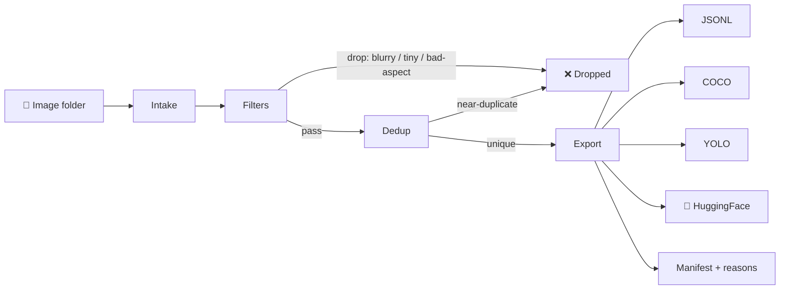

<div align="center">

# 🎯 curate-vision

**Turn messy image folders into clean, deduplicated, training-ready datasets — no GPU required.**

End-to-end vision dataset curation & pipeline toolkit.

[](https://github.com/kiraadityaa/curate-vision/actions/workflows/ci.yml)
[](LICENSE)
[](pyproject.toml)
[](https://github.com/astral-sh/ruff)
[](https://github.com/kiraadityaa/curate-vision/issues)

</div>

---

**High-quality data beats raw quantity** when training computer-vision models,
but the tooling to build it is scattered across a dozen half-maintained repos.
`curate-vision` bundles the stages you actually need —

```
intake → clean → dedup → export
```

— into one **typed, offline-first pipeline** with a simple CLI.



## ✨ Features

- ✅ **Intake** — recursive folder scan, metadata extraction, corrupt-file detection
- ✅ **Filters** — minimum resolution, aspect ratio, and blur detection (variance-of-Laplacian)
- ✅ **Perceptual dedup** — pHash/dHash near-duplicate removal within a Hamming-distance tolerance
- ✅ **Export** — JSONL manifest, COCO JSON, YOLO `.txt` labels, HuggingFace Dataset (Arrow)
- ✅ **Typed** — `pydantic` config, dataclass-first pipeline, fully annotated
- ✅ **Offline-first** — everything runs locally, no GPU required
- ✅ **Resumable** — checkpoints let you continue interrupted runs

## 📦 Installation

Requires Python 3.10+.

```bash
pip install curate-vision
```

Optional extras:

| Extra       | Provides                          |
|-------------|-----------------------------------|
| `datasets`  | HuggingFace Dataset (Arrow) export |
| `all`       | Everything, including dev tooling |

```bash
pip install "curate-vision[datasets]"
pip install "curate-vision[all]"
```

## 🚀 Quick start

```bash
curate-vision run ./photos \
  --out-dir out \
  --min-width 512 \
  --min-height 512 \
  --blur-threshold 60 \
  --dedup-tolerance 6 \
  --export-manifest \
  --export-coco
```

Try it on the bundled sample data:

```bash
pip install -e ".[dev]"
curate-vision run examples/data --out-dir out \
  --min-width 128 --min-height 128 --blur-threshold 10 \
  --export-manifest --export-coco --export-yolo
```

Example output:

```
Stage 1/3 Intake
  discovered 5 image(s)
Stage 2/3 Filters
  kept 3 after filters
Stage 3/3 Perceptual dedup
manifest -> out/manifest.jsonl
coco -> out/coco.json
yolo labels -> out/labels
   Curation summary
┏━━━━━━━━━━━━┳━━━━━━━┓
┃ Metric     ┃ Value ┃
┡━━━━━━━━━━━━╇━━━━━━━┩
│ total      │ 5     │
│ kept       │ 1     │
│ dropped    │ 4     │
│ duplicates │ 2     │
└────────────┴───────┘
Dropped reasons:
  blurry: 1
  too_small: 1
```

## 🖥️ CLI reference

```
curate-vision run INPUT_DIR [options]
```

| Option               | Default  | Description                                        |
|----------------------|----------|----------------------------------------------------|
| `--out-dir`          | `out`    | Directory for all outputs                          |
| `--recursive`        | `true`   | Scan subdirectories                                |
| `--min-width`        | `128`    | Minimum image width (px)                           |
| `--min-height`       | `128`    | Minimum image height (px)                          |
| `--blur-threshold`   | `50.0`   | Variance-of-Laplacian blur threshold               |
| `--dedup`            | `true`   | Enable perceptual dedup                            |
| `--dedup-tolerance`  | `6`      | Max Hamming distance for duplicate match           |
| `--export-manifest`  | `true`   | Write JSONL manifest                               |
| `--export-coco`      | `false`  | Write COCO JSON                                    |
| `--export-yolo`      | `false`  | Write YOLO label files                             |
| `--export-hf`        | `false`  | Write HuggingFace Dataset (Arrow)                  |
| `--checkpoint-every` | `500`    | Save a checkpoint every N items                    |
| `--version`          | —        | Show version and exit                              |

## 📚 Library API

```python
from curate_vision import PipelineConfig, run_pipeline

cfg = PipelineConfig(
    input_dir="photos",
    min_width=512,
    min_height=512,
    blur_threshold=60,
    dedup_tolerance=6,
)
result = run_pipeline(cfg)
print(result.summary())
# {'total': 1200, 'kept': 1043, 'dropped': 157, 'duplicates': 34, 'flags': {...}}
```

Inspect per-image metadata:

```python
for item in result.items:
    print(item.path.name, "kept" if item.included else "dropped", item.flags)
```

## ⚙️ Pipeline stages

| # | Stage   | What it does                                                     |
|---|---------|------------------------------------------------------------------|
| 1 | Intake  | Scans a folder, reads dimensions/format/size, flags corrupt files |
| 2 | Filters | Drops undersized, bad-aspect, or blurry images                    |
| 3 | Dedup   | Near-duplicate detection via pHash + Hamming distance             |
| 4 | Export  | Writes manifests, labels, and datasets                            |

### Output formats

```
out/
├── manifest.jsonl       # every item + flags (kept/dropped + why)
├── coco.json            # COCO-format annotations (if --export-coco)
├── labels/*.txt         # YOLO format labels (if --export-yolo)
└── huggingface/         # Arrow dataset (if --export-hf)
```

## 🗺️ Roadmap

- [x] Intake: local folder
- [x] Filters: size, aspect, blur
- [x] Dedup: perceptual hashing
- [x] Export: JSONL / COCO / YOLO / HuggingFace
- [ ] Intake: HuggingFace datasets, video frame extraction
- [ ] Enrichment: VLM captioning (Qwen2.5-VL, MiniCPM) via Ollama/llama.cpp
- [ ] Quality scoring: aesthetics + relevance composite score
- [ ] NSFW & poison-image filtering

## 🤝 Contributing

Contributions are welcome! See [CONTRIBUTING.md](CONTRIBUTING.md) for the dev
setup and contribution workflow, and please follow our [Code of Conduct](CODE_OF_CONDUCT.md).

Security issues? See [SECURITY.md](SECURITY.md).

## 📄 License

Distributed under the [Apache-2.0](LICENSE) license.