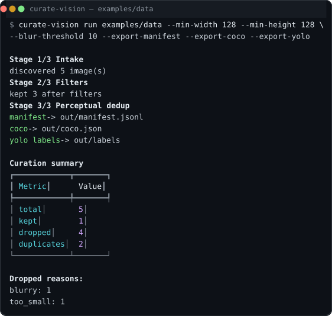

# curate-vision

CLI and library to turn messy image folders into clean, deduplicated,
training-ready datasets. Runs locally, no GPU required.

[](https://github.com/kiraadityaa/curate-vision/actions/workflows/ci.yml)
[](LICENSE)
[](pyproject.toml)
[](https://github.com/kiraadityaa/curate-vision/actions)



## What it does

A four-stage pipeline over a local image directory:

```
images/ ──→ intake ──→ filters ──→ dedup ──→ export
                        │              │
                        └─→ dropped    └─→ near-duplicate: dropped
                            (reason       (kept one is referenced)
                             in manifest)
```

Every decision is recorded in a JSONL `manifest.jsonl` — what was kept, what
was dropped, and why. Nothing is deleted; the manifest is the output you act on.

The pipeline is deliberately small. It is **not** a scraper (see
[`img2dataset`](https://github.com/rom1504/img2dataset)) and **not** a document
parser (see [`docling`](https://github.com/docling-project/docling)). It is the
clean-up step you run on a folder you already have, before training or labeling.

## Install

Requires Python 3.10 or newer.

```bash
pip install curate-vision
```

HuggingFace export needs the `datasets` extra; `all` also installs dev tooling.

```bash
pip install "curate-vision[datasets]"
pip install "curate-vision[all]"
```

## Usage

```bash
curate-vision run ./photos \
  --out-dir out \
  --min-width 512 \
  --min-height 512 \
  --blur-threshold 60 \
  --dedup-tolerance 6 \
  --export-manifest \
  --export-coco
```

Try the bundled sample data:

```bash
pip install -e ".[dev]"
curate-vision run examples/data --out-dir out \
  --min-width 128 --min-height 128 --blur-threshold 10 \
  --export-manifest --export-coco --export-yolo
```

The demo above is what the screenshot shows: of 5 sample images, 3 pass the
filters, then dedup flags 2 near-duplicates, leaving 1 image in the output.

### Options

```
curate-vision run INPUT_DIR [options]
```

| Option               | Default | Description                              |
|----------------------|---------|------------------------------------------|
| `--out-dir`          | `out`   | Directory for all outputs                |
| `--recursive`        | `true`  | Scan subdirectories                      |
| `--min-width`        | `128`   | Minimum image width (px)                 |
| `--min-height`       | `128`   | Minimum image height (px)                |
| `--blur-threshold`   | `50.0`  | Variance-of-Laplacian blur threshold     |
| `--dedup`            | `true`  | Enable perceptual dedup                  |
| `--dedup-tolerance`  | `6`     | Max Hamming distance for a duplicate     |
| `--export-manifest`  | `true`  | Write JSONL manifest                     |
| `--export-coco`      | `false` | Write COCO JSON                          |
| `--export-yolo`      | `false` | Write YOLO `.txt` labels                 |
| `--export-hf`        | `false` | Write HuggingFace Dataset (Arrow)        |
| `--checkpoint-every` | `500`   | Save a checkpoint every N items          |
| `--version`          | —       | Show version and exit                    |

## How it works

**Intake** walks the input directory, reads each image's dimensions, format,
and size, and tags unreadable files as `corrupt` instead of crashing the run.

**Filters** short-circuit an item on the first failing check:

- width or height below the minimum → `too_small`
- aspect ratio beyond `max_aspect_ratio` → `bad_aspect`
- pixel count below `min_file_size` (disabled by default) → `too_small_file`
- `variance_of_laplacian(image) < blur_threshold` → `blurry`

**Dedup** compares a 64-bit perceptual hash (pHash, plus dHash kept for
reference) of every surviving image. Images within
`Hamming_distance <= dedup_tolerance` bits of an earlier image are marked
`duplicate_of=<kept path>` and excluded. The first member of a group is kept.

Corrupt or unfilterable items are excluded before hashing, so a broken file
cannot poison the dedup stage.

## Output

```
out/
├── manifest.jsonl       # every item: metadata + flags + decision
├── coco.json            # COCO annotations (if --export-coco)
├── labels/*.txt         # YOLO labels (if --export-yolo)
└── huggingface/         # Arrow dataset (if --export-hf)
```

One line of a real manifest:

```json
{"path":"examples/data/grayscale_park.png","width":320,"height":224,"format":"PNG","file_size":1730,"blur_score":346.4,"phash":"e2c3851d3ebe01e5","dhash":"55cacdad2d52a100","flags":[],"included":true,"duplicate_of":null}
```

`included=false` lines carry the reason in `flags` or a reference in
`duplicate_of`, so you can decide downstream (hard delete, review queue, etc.).

## Python API

```python
from curate_vision import PipelineConfig, run_pipeline

cfg = PipelineConfig(input_dir="photos", min_width=512, min_height=512)
result = run_pipeline(cfg)

print(result.summary())
# {'total': 1200, 'kept': 1043, 'dropped': 157, 'duplicates': 34, 'flags': {...}}

for item in result.items:
    if not item.included:
        print(item.path, item.flags, item.duplicate_of)
```

## Planned

- Intake from HuggingFace datasets and video frame extraction
- VLM captioning (Qwen2.5-VL, MiniCPM via Ollama / llama.cpp)
- Composite quality score (aesthetics + relevance)
- NSFW and poison-image filters

## Contributing

See [CONTRIBUTING.md](CONTRIBUTING.md) and the [Code of Conduct](CODE_OF_CONDUCT.md).
Security issues: [SECURITY.md](SECURITY.md).

## License

Apache-2.0. See [LICENSE](LICENSE).

Changes are recorded in [CHANGELOG.md](CHANGELOG.md).